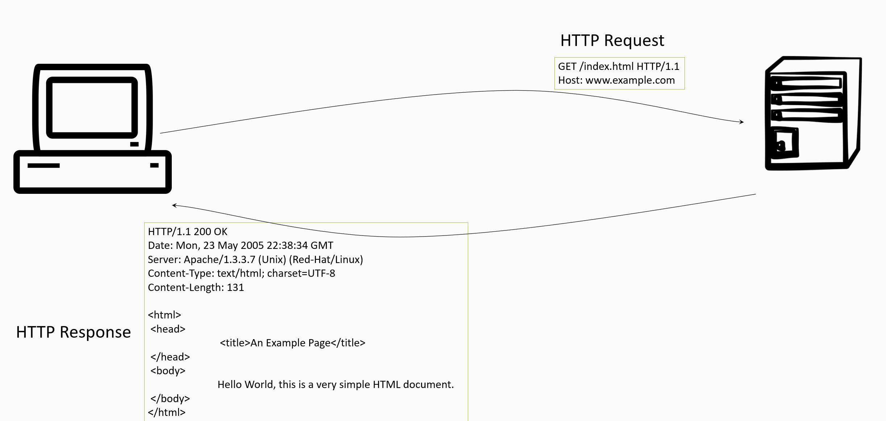

# HTTP
Hypertext Transfer Protocol (HTTP) is an application layer protocol used to transmit data between a web client and a web server. The client issues a request and waits for a response from the server. The server can only send data in response to a request. 

HTTP is a stateless protocol, which means that the server has no way of knowing that two subsequent requests are related even if they are carried out on the same connection. To the server each request is independent and unrelated to other requests. This is problematic. Imagine a server maintaining a shopping basket not being able to link requests to each other.

While the core of HTTP is stateless, servers are able to bundle requests into sessions thanks to other technologies such as HTTP cookies. A shopping basket is part of a session, a session is given a session identifier, and this identifier is stored in a HTTP cookie. 

> The fact that a server can only respond to a client after the client has issued a request is an important disadvantage. Today this is sometimes circumvented by using web sockets, which is an advanced technology that makes two-way communication possible (https://developer.mozilla.org/en-US/docs/Web/API/WebSockets_API).

# Source attribution
Some parts of this page are based on [HTTP](https://developer.mozilla.org/en-US/docs/Web/HTTP) and [An overview of HTTP](https://developer.mozilla.org/en-US/docs/Web/HTTP/Overview) by Mozilla Contributors, which is licensed under [CC-BY-SA 2.5](http://creativecommons.org/licenses/by-sa/2.5/).