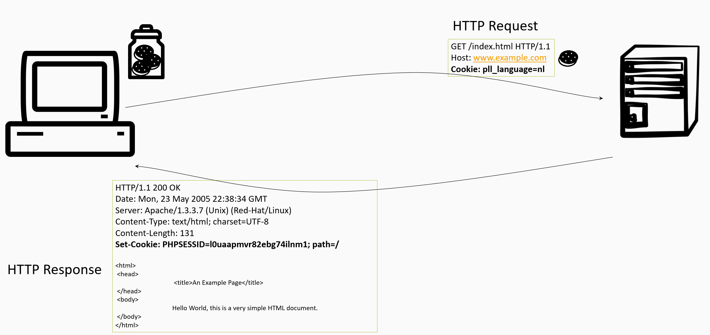

# Cookies
An HTTP cookie (web cookie, browser cookie) is a small piece of data that a server sends to the user's web browser. The browser may store it and send it back with the next request to the same server. Typically, it's used to tell if two requests came from the same browser — keeping a user logged-in, for example. It remembers stateful information for the stateless HTTP protocol.

Cookies are mainly used for three purposes:
* Session management (Logins, shopping carts, game scores, or anything else the server should remember)
* Personalization (User preferences, themes, and other settings)
* Tracking (Recording and analyzing user behavior)

Cookies were once used for general client-side storage. While this was legitimate when they were the only way to store data on the client, it is recommended nowadays to consider alternatives such as local storage, session storage or indexedDB. Cookies are sent with every request, so they can worsen performance (especially for mobile data connections).

# Source attribution
Some parts of this page are based on [Cookies](https://developer.mozilla.org/en-US/docs/Web/HTTP/Cookies) by Mozilla Contributors, which is licensed under [CC-BY-SA 2.5](http://creativecommons.org/licenses/by-sa/2.5/).