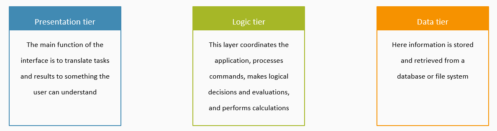

# Multitier architecture
A typical architecture used in software is the multitier architecture. The amount of tiers can differ, depending on the complexity of the application. In its most simplest form, there is just one tier. However, this is bad software design and small changes will have a large impact. 

The three-tier archtiecture separates the presentation tier, the logic tier, and the data tier. When writing a web application, you should think about the software architecture before building the application:
* what logic is going to be executed by JavaScript (client-side)? 
* what logic is going to be executed server-side? 
* how is my server-side logic going to access the database?

All code executed client-side should be considered compromised, and checks that are important for security (e.g. input validation) must be repeated server-side.  

# APIs, libraries, and frameworks
The following list provides an overview of the different APIs that are used by web application developers, and how they relate to javascript libraries and frameworks.

* **JavaScript** — A high-level scripting language built into browsers that allows you to implement functionality on web pages/apps. Note that JavaScript is also available in other programming environments, such as Node. 
* **Browser APIs** — constructs built into the browser that sits on top of the JavaScript language and allows you to implement functionality more easily. Examples are the Audio API and the [WebAuthn API](https://www.w3.org/TR/webauthn/). 
* **Third-party APIs** — constructs built into third-party platforms (e.g. Twitter, Facebook) that allow you to use some of those platform's functionality in your own web pages (for example, display your latest Tweets on your web page). Alternatively, your own server can be a third party to the client code running in the browser. The client can then [fetch data](https://developer.mozilla.org/en-US/docs/Learn/JavaScript/Client-side_web_APIs/Fetching_data) from this server. 
* **JavaScript libraries** — Usually one or more JavaScript files containing custom functions that you can attach to your web page to speed up or enable writing common functionality. Examples include jQuery, Mootools and React. 
* **JavaScript frameworks** — The next step up from libraries, JavaScript frameworks (e.g. Angular and Ember) tend to be packages of HTML, CSS, JavaScript, and other technologies that you install and then use to write an entire web application from scratch. The key difference between a library and a framework is “Inversion of Control”. When calling a method from a library, the developer is in control. With a framework, the control is inverted: the framework calls the developer's code.

# Source attribution
Some parts of this page are based on [Introduction to web APIs](https://developer.mozilla.org/en-US/docs/Learn/JavaScript/Client-side_web_APIs/Introduction) by Mozilla Contributors, which is licensed under [CC-BY-SA 2.5](http://creativecommons.org/licenses/by-sa/2.5/).