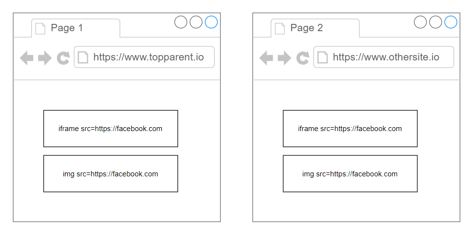
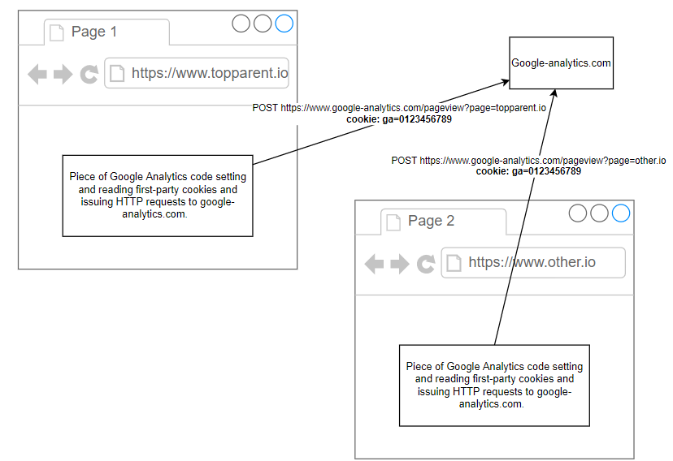
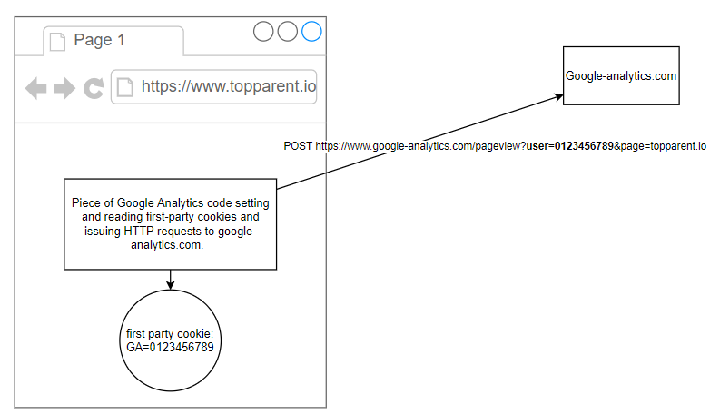
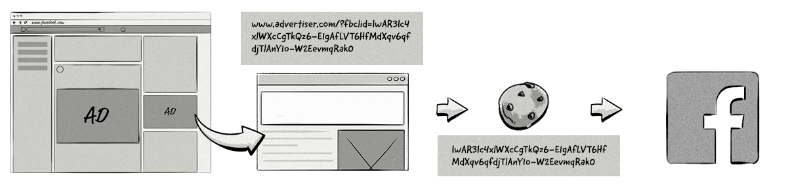

# Tracking on the web
Browsers are fighting to be called 'the most privacy-friendly browser' these days. While privacy is not at the core of this course, security specialists should understand the basic mechanisms that can be used to track people across the web.

Tracking relies on invisible code embedded in web pages. Most companies like to track you across different websites since this allows creating a detailed profile of what you do online. The better the profile, the more valuable it is. In this chapter, we'll go over some of the most common mechanisms that are used for tracking. 

## Cookies
Cookies are the most obvious way to track users since they are sent as long as the domain and path of the cookie match those of the request. This is true even if the domain in the request is not the same domain as the top parent (i.e. the site that you are actually visiting). Originally, this allowed for easy tracking as shown on the image below:

Since all cookies linked to facebook.com/ were sent along with the request when loading the iframe or when loading the image, Facebook could easily track you across the two websites shown above. This would even work when you did not have an account or were not logged in, although in that case the tracking could not be linked to an actual person. But still, the profile (_a_ person having visited website A and B) was worth a lot of money.

## First-party and third-party cookies
Since a couple of years now, browsers are much more privacy aware, and a counter-measure against tracking which has received a lot of attention lately is the blocking of (some) third party cookies. Third-party cookies are cookies that are linked to a different domain than the one you are currently on. 

Blocking this kind of cookies effectively blocks the tracking mechanism explained above: no cookies are sent along to Facebook, so Facebook cannot link the page visit to site A to that of site B (i.e. cross-site tracking), neither can it link these visits to you as a person. However, it also blocked the ability to track return visits. Site A might have been using a tool like Google Analytics to track unique visitors and return visits, without necessarily wishing to track cross-site behaviour. However, since it relied on the same mechanisms (third-party cookies), this suddenly became impossible.

To combat this, tools like Google Analytics have moved to first-party cookies: a piece of Google Analytics Javascript is added to site A's website, which writes a first-party cookie. In case a user returns to the website (with the same browser, and assuming cookies were not cleared), the Javascript code accesses the unique first-party cookie, and understands that the same user has visited the page. Next, it ships this information to the Google Analytics code using a simple cross-site request with the tracking information in URL parameters:

In summary, companies used to be able to track cross-site visits using requests to other domains and third-party cookies as shown on the following figure:

 However due to the block of third-party cookies, they moved to tracking in-site visits by relying on first-party cookies and translating the information to URL parameters which are shipped of cross-site:

 The important difference between the two images above is that in the latter image, the requests to Google Analytics do not include a cookie. Instead, the unique identifier was put in an URL parameter by Javascript. In any case, this is better for our privacy since cross-site tracking using cookies is not possible using this method.  

## Pixels and other invisible tracking content
The term 'tracking pixel' is often misunderstood since it does not necesarily involve placing a image pixel on a website. The concept is sometimes also used for more advanced tracking code such as Javascript code. 

Let's consider the example of the Facebook pixel. When you're browsing your Facebook timeline, you may see an interesting advertisement which you click. This click triggers a whole process that actually re-allows cross-site tracking for Facebook, as long as the advertiser's website and Facebook collaborate (which they usually do). Consider the following visual explanation of a pixel:

The process is as follows:
- You click an advertisement (URL) in your Facebook timeline, this URL has a unique code that Facebook linked to you and that leads to the advertiser's website;
- The advertiser's website has Facebook code running which catches the unique code and turns it into a first-party cookie;
- Linking this to what we've seen before in this chapter, Facebook now has a first-party cookie which is uniquely tied to you as a person, and this until you clear your cookies. 

## Fingerprinting and other advanced methods.
Apart from using plain cookies (which are pretty binary: they work or they do not work), other more advanced mechanisms exist to track you cross-site. 

Browser fingerprinting is a popular method since browser's fingerprints approve to be quite unique. While the request to fetch a resource at Facebook may not include unique cookies, your browser may have a unique fingerprint collected by site A and communicated to Facebook (again, if they cooperate with Facebook). If this fingerprint has not changed when you visit the next site, Facebook can effecitvely track you cross-site. You can test the uniqueness of your browser [here](https://coveryourtracks.eff.org/).

IP addresses are another, easy method to track users: while the request to fetch a resource at Facebook may not include unique cookies, Facebook's servers do log your IP address. If this IP address has not changed when you visit the next site, Facebook can effecitvely track you cross-site. 

To conclude this section, Samy Kamkar, who is a famous hacker, has created the ['evercookie'](https://samy.pl/evercookie/). This is out of scope for this course but an interesting read nevertheless, since he demonstrates how many storage locations (apart from cookies) exist in browsers to store identifiable information.

## Default browser behaviour
Default browser behaviour is quickly changing. However, Firefox allows you to try out a lot of configurations. I invite you to try them out. What's interesting is that Firefox by default does not necessarily block all third-party cookies, but a distinction is made between known third-party tracking cookies and other third-party cookies. More information is [here](https://support.mozilla.org/en-US/kb/disable-third-party-cookies). 

## Future
There's a lot of interesting technology behind advertisements on the Internet. It's a sector where a lot of money is at stake and where there's a constant drive for innovation to circumvent privacy measures taken by browser vendors. This may lead to new tracking mechanisms which are not described in this chapter. Those interested in the financial part of advertisements may look at [real-time bidding](https://en.wikipedia.org/wiki/Real-time_bidding). However, that is out of scope for this course. 

Some parts of this page are based on [Trackers and scripts firefox blocks](https://support.mozilla.org/en-US/kb/trackers-and-scripts-firefox-blocks-enhanced-track) by Mozilla Contributors, which is licensed under [CC-BY-SA 2.5](http://creativecommons.org/licenses/by-sa/2.5/).