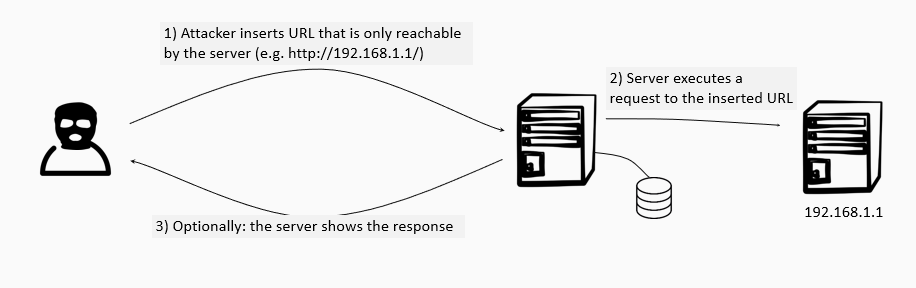

# Why and how does SSRF work?
An attacker can usually only reach applications that are exposed to the Internet. Applications running locally on the server (i.e. bound to the localhost interface - 127.0.0.1), or non-internet exposed applications running in the same network as the server are usually not reachable to the attacker. However, through a successful server-side request forgery attack the attacker can trick the server into executing requests and thereby circumvent these restrictions. Indeed, since these requests are initiated by the server, they are treated with much more trust. 

Visually, the attack looks as follows: 

Examples of requests to applications that are not intended to be exposed but that are likely to succeed when they are executed from the trusted server:
* requests to the localhost interfaces;
* requests to other applications on the same private network;
* requests to servers that have IP filtering enabled.

# How can we protect against SSRF?
The first defense would of course be to not have any back-end functionality in place that requires calling an external URL based on user input. 

However, if such functionality is required, the following defense mechanisms should be deployed:
* whitelist + input validation: ensure that the url that is called based on user input is part of a whitelist
* whitelist + network layer protection: ensure that only whitelisted urls can be reached via the network (e.g. through firewall configurations)
* blacklist: if a whitelist approach is infeasible, ensure that there is a blacklist which at least comprises the localhost interface and all private internet address ranges (such as 192.168.0.0). This list must be completed with all internally used domain names if the blacklist check occurs at application level (since the DNS translation happens after the blacklist has been checked). 

# Source attribution
Some parts of this page are based on [Server Side Request Forgery](https://owasp.org/www-community/attacks/Server_Side_Request_Forgery) and [Server Side Request Forgery Prevention](https://cheatsheetseries.owasp.org/cheatsheets/Server_Side_Request_Forgery_Prevention_Cheat_Sheet.html#challenges-in-blocking-urls-at-application-layer) by OWASP, which is licensed under [FLOSS](https://owasp.org/about/).