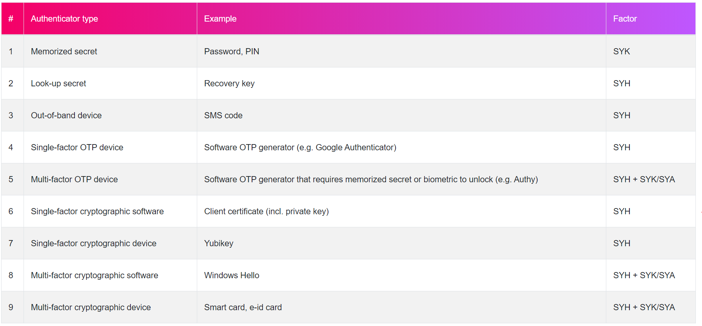

# Alternative authentication mechanisms
Even when federation and Single Sign On is used, a user still has to authenticate. Perhaps authentication is required only once a day, or once a week, but the user stil has to authenticate at some point in time. 

SAML, OAuth2, or OIDC do **not** prescribe how users have to authenticate. The way a user must authenticate is configured in the authentication component. Many solutions exist that can be used for this authentication component: Auth0, IdentityServer, ADFS, AWS Cognito, Keycloak, Shibboleth, PING, IBM ISAM, etc. What many of these solutions have in common is their ability to support multiple authentication mechanisms. 

The NIST 800-63B publication has created an exhaustive list of authentication types:

I'm sure you'll recognize some examples in this list. 