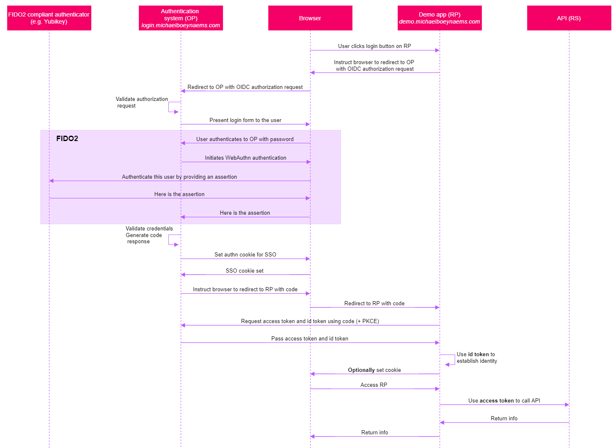

# FIDO2
## What is FIDO2
FIDO2 is the successor of the original FIDO standard. The original FIDO standard did not get adopted by many vendors and could not really be called a success. FIDO2 is a different story since it was co-created together with [W3C](https://www.w3.org/Consortium/), an international community where web standards are developed. Therefore it is now being supported by many browsers and is quickly gaining a lot of traction. 

FIDO2 consists of two specifications:
* [WebAuthn](https://www.w3.org/TR/webauthn/), now maintained by W3C
* [CTAP](https://fidoalliance.org/specs/fido-v2.0-ps-20190130/fido-client-to-authenticator-protocol-v2.0-ps-20190130.html), still maintained by the FIDO Alliance

The WebAuthn specification enables the use of strong single-factor cryptographic authenticators such as a Yubikey or Windows Hello in an easy, platform-independent manner. It does so by defining a browser API that web developers can call via **JavaScript** to initiate the authentication. All complexity of reading a fingerprint scanner or understanding the Windows Hello protocol is abstracted away for the developer! 

> CTAP is out of scope for this course. It specifies the communication between an authenticator (e.g. a Yubikey, which is a USB or NFC enabled security key used for strong authentication) and a platform (e.g. Windows). By extension, this spec describes the link between the [platform and recent browsers](https://www.chromestatus.com/feature/4781249621131264) as well. CTAP is relevant only to manufacturers of authenticators, developers of the firmware for these devices, and to browser creators such as Mozilla or Google. 

## What's in it for you
The impact of this should not be misunderstood: any web-based application can now effortlessly support the plethora of FIDO2 compliant strong authenticators. They can do so simply by calling the APIs as specified in the WebAuthn standard. Before WebAuthn, if an application wished to adopt facial recognition, they had to search for complex and sometimes expensive facial recognition software that could be run in Javascript, or build middleware that users had to install first. WebAuthn will work for mobile apps too, which means that requiring a fingerprint to authenticate in your app will be easier than ever before.

## What is the link with the federation protocols
Let's look at the same OIDC flow that we discussed before, but now in a situation where the user authenticates using a FIDO2 authenticator:

The only change in the flow is the purple part. Instead of using a simple authentication mechanis such as passwords, a Yubikey is used to authenticate the user. 