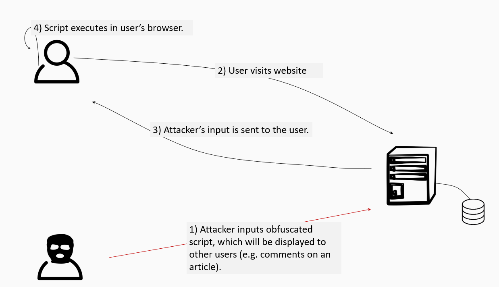

# Cross-site scripting (XSS)
Cross-Site Scripting (XSS) attacks are a type of injection attack, in which malicious scripts are injected into otherwise benign and trusted websites. XSS attacks are successful when these malicious scripts are then shown in victim users' browsers. Since the victim user’s browser has no way to know that the script should not be trusted, it will be executed. Moreover, because it runs on the same origin as the trusted application, the malicious script can access any cookies, session tokens, or other sensitive information retained by the browser and used with that site. These scripts can even rewrite the content of the HTML page.

The following video explains quite well how XSS works and how it was used to hack Twitter by [creating a self-retweeting tweet](https://www.youtube.com/watch?v=zv0kZKC6GAM).

# Impact of XSS
Successful XSS attacks often lead to a serious compromise of your application. Attackers may steal cookies, they can initiate forged requests (leading to CSRF), they can manipulate the DOM, steal security tokens, etc. [This website](http://www.xss-payloads.com/) keeps a list of potentially useful XSS payloads. 

# Types of XSS
## Stored XSS (type I)
Stored XSS generally occurs when user input is stored on the target server, such as in a database, in a message forum, visitor log, comment field, etc. A victim will then retrieve the stored data from the web application without that data being made safe to render in the browser. With the advent of HTML5 and other browser technologies, we can envision the attack payload being permanently stored in the victim’s browser, such as an HTML5 database, and never being sent to the server at all.

A typical example is a profile page, where people are able to enter their own personal information which is then stored in a database. Should a malicious user enter `` instead of `Michael` for example, this may lead to a stored XSS vulnerability unless precautions are taken. 

## Reflected XSS (type II)
Reflected XSS occurs when user input is immediately returned by a web application in an error message, search result, or any other response that includes some or all of the input provided by the user as part of the request, without that data being made safe to render in the browser, and without permanently storing the user provided data.

An example may be when an attacker tries to send the victim to the following page: `https://www.example.org/home?display=` . In case the application uses the data from the `display` querystring to construct the page, this may lead to an XSS vulnerability. 

## DOM-based XSS (type 0)
As defined by Amit Klein, who published the first article about this issue, DOM Based XSS is a form of XSS where the entire XSS flow takes place in the browser (the DOM). It is very similar to reflected XSS, but an important difference is that the injected script is never sent to the application's server. 

For example, an attacker could inject script using a URL fragment instead of a query string: `https://www.example.org/home#display=`. In case other scripts in the browser use the `display` fragment to alter the page, this may lead to an XSS vulnerability. 

# Attack scenario
The following is a step-by-step description of a stored XSS attack:
* Attacker injects script in an otherwise benevolent application;
* Victim visits the benevolent application;
* The attacker's script is sent to the victim's browser;
* The attacker's script is executed in the victim's browser. 

# Preventing XSS
The recommendations to protect against XSS are the following:
* validate user input (something which should not only be done to protect against XSS!)
* deploy context-sensitive output encoding
* deploy a strict content security policy (CSP)

These defenses will be discussed in the next pages. 

Other measures for specific circumstances exist:
* sanitize user input (in case you want to render pure HTML in your application)
* sandboxing (in case you iframe other websites such as Youtube) => this won't be covered in this course

# Source attribution
Some parts of this page are based on [Cross Site Scripting (XSS)](https://owasp.org/www-community/attacks/xss/) and [Types of XSS](https://owasp.org/www-community/Types_of_Cross-Site_Scripting), which are licensed under [FLOSS](https://owasp.org/about/).