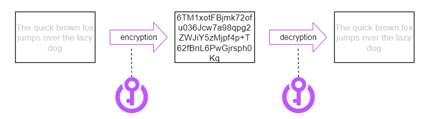
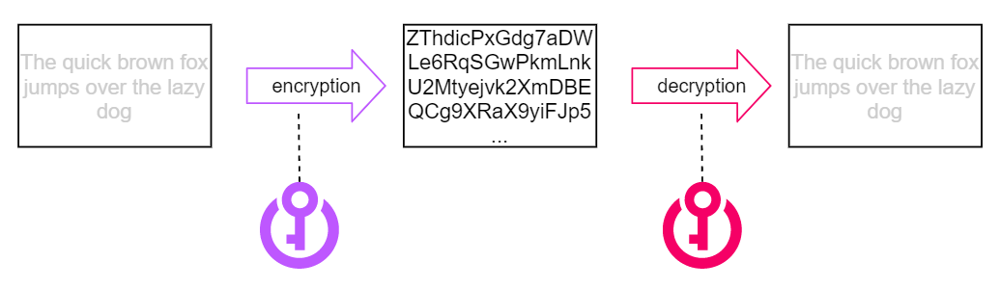
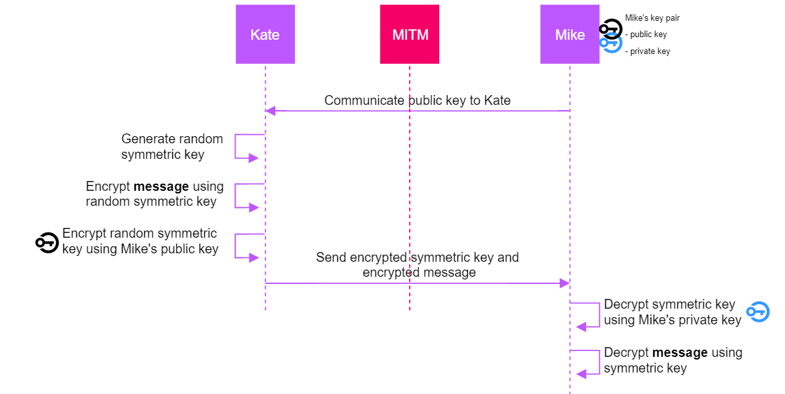
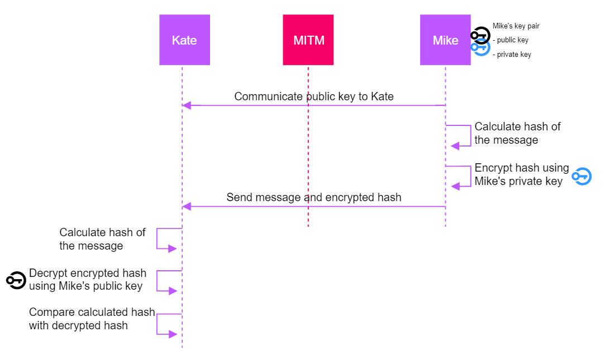
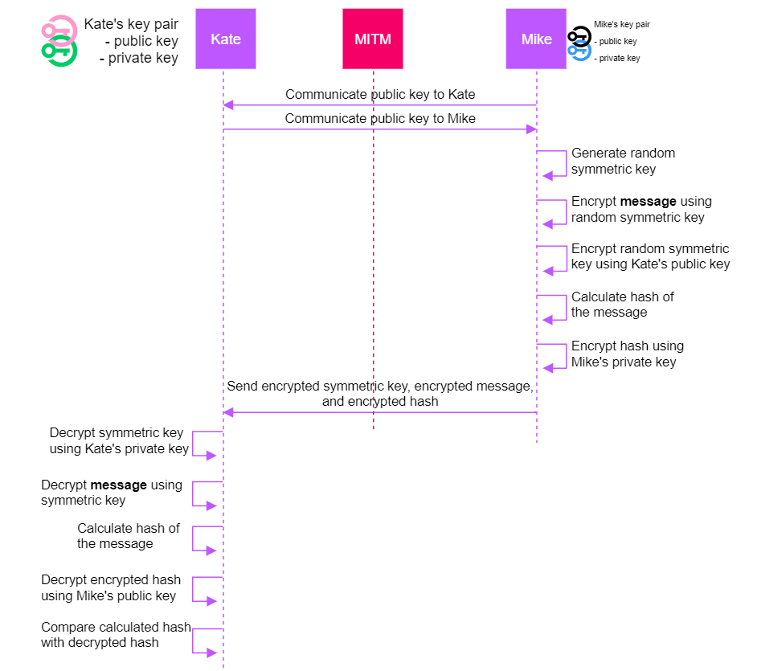

# Encryption
Encrypting _plaintext_ turns it into _ciphertext_. To turn _plaintext_ into _ciphertext_, a method, also known as a _cipher_ or _algorithm_ must be followed. 

# Symmetric key cryptography
## Symmetric encryption
Symmetric encryption is encryption as we all know it. The same key is used for both the encryption as well as the decryption:

Only one key is used here, the purple one. This immediately introduces a problem, since the sender encryptiong the message and the receiver decrypting the message may be geographically far apart from each other. How can they securely exchange the key? Through email? By encrypting it? With which key? The only way to securely exchange a key, is by having the sender and receiver meet in person, which obviously nullifies the advantages of digital communication. 

## Symmetric key concepts
In a symmetric encryption scheme, the key is called `symmetric key`, `secret key`, or `private key`. Note that using term `private key` in the context of symmetric cryptography often sparks confusion since it is usually associated with public key cryptography, which we will address in the next section. 

Symmetric algorithms used often today are:
* AES
* Twofish
* Threefish

# Public key cryptography
Public key cryptography is seen as black magic by some, while in reality it leans on basic mathematical concepts to achieve its properties. 

In general, public key cryptography can be used for three purposes:
* asymmetric encryption
* digital signatures
* shared secret generation

All three purposes have their use and are widely used. Let's briefly consider each of them. 

## Asymmetric encryption
In contrast to symmetric encryption, a different key is used for the inverse operation in asymmetric encryption. If key 1 is used for the encryption operation, then key 2 must be used for the decryption operation and vice versa. Do note that key 1 and key 2 are mathematically related and are always generated together. 

One key is called the `private key`, and must always be kept private. The other key is called the `public key`, and may be shared publicly. Together, these keys form a `keypair`. 

In order to securely exchange messages, at least one party (either the sender or the receiver) must possess such a keypair. The sending party will always use the public key of the receiving party when it wishes to send a confidential message. When a message is encrypted using the public key, it can only be decrypted using the private key. Since it is assumed that the receiving party has kept its private key private, only the receiver will be able to decrypt the message. 

Asymmetric encryption should never be used to encrypt or decrypt large volumes of data (`bulk encryption`). It is not performant to do so, and may introduce a lot of overhead. However, asymmetric encryption is very useful to encrypt small amounts of data. More in particular, asymmetric encryption is used to encrypt and decrypt:
* symmetric keys
* hashes (used in digital signatures, see a bit further in this section)

It can be useful to encrypt a symmetric key using asymmetric encryption, since that may solve our key distribution problem, as visualized in the next image:

Mike only needed to communicate his public key to Kate, and the symmetric key (which is small) could be exchanged. This symmetric key was used to encrypt the message, which may be (very) large. 

Well-known asymmetric encryption algorithms include:
* RSA 

## Digital signatures
Another purpose of public key cryptography are digital signatures. Digital signatures focus on protecting the integrity of a message, in contrast to asymmetric encryption which had the focus on protecting the confidentiality of a message. 

`Signing` a message entails nothing more than combining some of the concepts we have already covered previously. 

The first step is hashing the message. As we've seen before, hashing a message results in a digest. This calculation is one-way, meaning the digest cannot be used to create the original message. Also, changing only one bit of the message results in a digest which is completely different from the one calculated over the original message. 

The second step is encrypting that hash using the **private key of the sender**. This is the opposite of what we had to do when we tried to protect the confidentiality, since in that case we had to encrypt the message using the **public key of the receiver**. The reason we have to use the private key of the sender when signing a message is because we want to proof to the receiver that the message has not been tampered with. This is a completely different purpose (protecting integrity) than the purpose of asymmetric encryption (protecting confidentiality).

Well-known digital signature algorithms include:
* DSA
* ECDSA
* DSS

## Combining asymmetric encryption and digital signatures
Often when you send a message you want to protect both the confidentiality as well as the integrity. Indeed, you do not want attackers to be able to read the data, but you also do not want them to modify it. 

In such a case, we simply combine the two schemes:
* Signing it:
    * hashing the message
    * encrypting that hash using the **sender's private key**
* Encrypting it:
    * Creating a symmetric key and encrypting the message with that symmetric key
    * Encrypting that symmetric key using the **receiver's public key**

Such a combined scheme is shown in the next visualization. This visualization also explains how the receiver of a digital signature is able to verify it. 

## Shared secret generation
The last of the three purposes of public key cryptography is shared secret generation. Key generation is no magic, its main purpose is that both the sender and the receiver come up with a shared secret which will typically be used as a symmetric key so they can encrypt large messages. 

Two types of key generation algorithms exist:
* dynamic 
* static

In fact, we have already covered the static variant in our explanation about asymmetric encryption. Indeed, asymmetric encryption was only used to encrypt a symmetric key, which could then be used further to encrypt large amounts of bulk data. In other words, the sender `generated` a symmetric key and communicated it to the receiver using asymmetric encryption. Most asymmetric encryption algorithms can therefore be used as a static key generation algorithm (such as RSA). 

The other variant, the dynamic one, is special. These allow us to generate a shared secret on the fly, thus also providing forward secrecy. While we won't dive into the details of dynamic secret generation, it suffices to understand that two parties using these algorithms can securely generate a shared secret over an untrusted channel. Dynamic key generation algorithms include:
* DH(E)
* ECDH(E)

# Forward secrecy
Forward secrecy means that a message can be kept confidential even if the (static) secret key is stolen from the server. It entails creating a new shared secret on the fly which is kept in memory and only used during the session. After the session ends, the generated shared secret is purged and cannot be retrieved anymore. The main purpose of forward secrecy is to protect against an adversary logging encrypted traffic for years and years, until some day the server's private key is compromised. If no forward secrecy protocols would have been used, the adversary would then be able to decrypt all traffic he or she has been collecting over the years. However, in case forward secrecy was used, he or she won't be able to decrypt anything from the past. 
