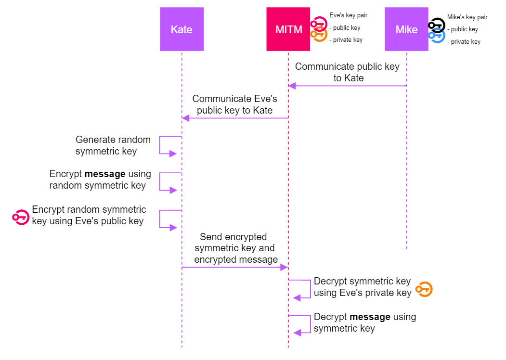
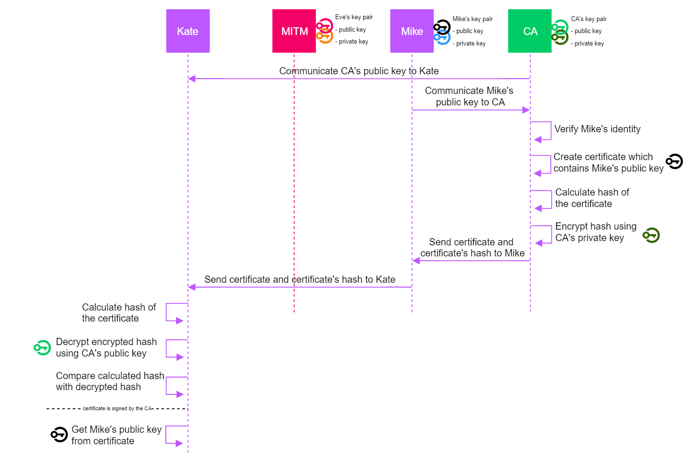
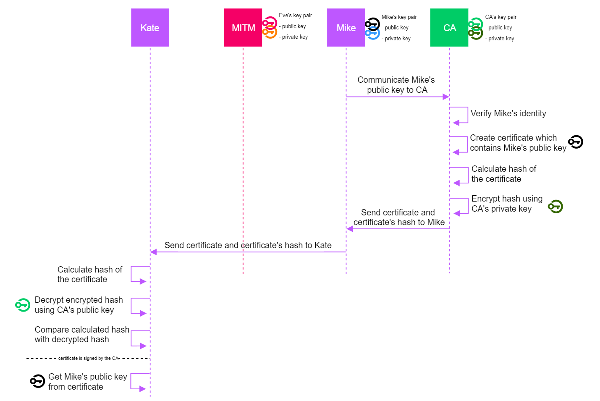
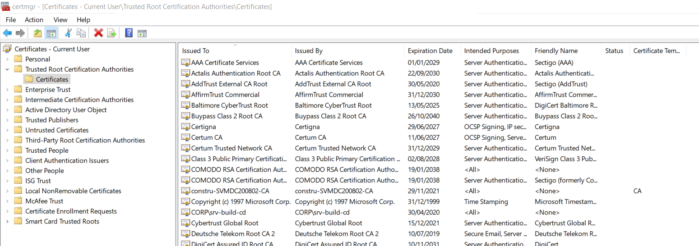
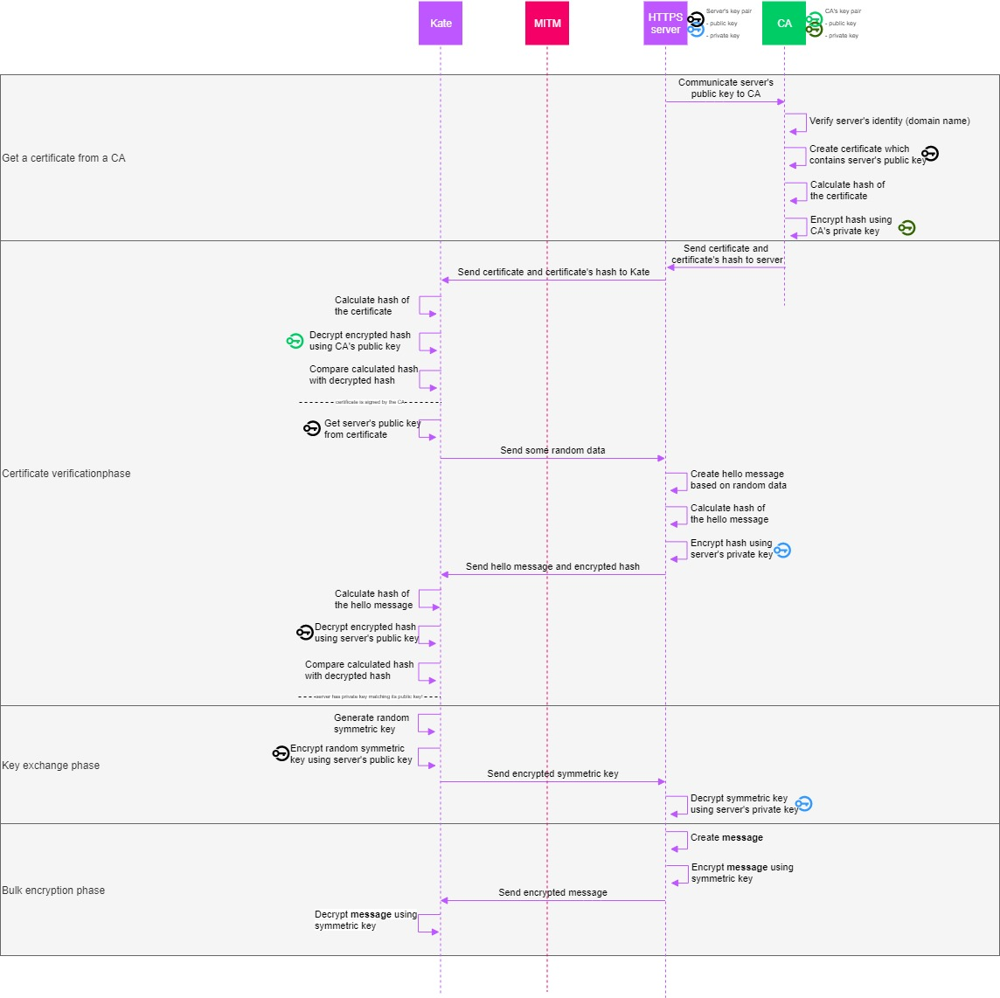

# PKI
## What is PKI
The three use cases of public key cryptography (asymmetric encryption, digital signatures, and shared secret generation) carry an important assumption: the public keys are public. This sounds like an assumption we may make, after all, they are called public keys for a reason. 

However, take a look at the following visualization:

A man-in-the-middle was able to replace Mike's public key with the public key of the attacker. Kate then unknowingly uses the attacker's public key, which makes it trivial for the attacker to read the message being exchanged. A similar attack can be executed against digital signatures. 

So, how can Kate be certain that the public key is indeed Mike's? That's where PKI, or Public Key Infrastructure comes into play. It is basically a set of agreements between several parties which allows devices and people to certify that a certain public key belongs to a particular user or device. 

## How does PKI work
PKI is a hierarchical system, where a few Certification Authorities (CAs) are allowed to create documents that prove the link between a public key and a user (or device, hostname, etc.). Since we are living in a digital world, these documents are digital documents. We call them _certificates_. These documents must be public (they contain public information such as your public key) so their confidentiality is not important. However, their **integrity** is extremely important. 

How do we protect the integrity of digital documents? That's right, by digitally signing it. The certificate will be digitally signed by the Certification Authority (CA). Of course that digital signature must be verified by the party receiving that certificate. Let's take a look at what the flow looks like when Mike buys a certificate at a trusted CA and sends it to Kate:

So, the flow became a little bit more complicated, but did it become more secure as well? Not really, since a man-in-the-middle could easily intercept the CA's public key which is sent to Kate in the first step. So the introduction of the CA moved the problem:
* before introducing a CA, the man-in-the-middle could intercept the public key of Mike and replace it with his own
* after introducing a CA, the main-in-the-middle could intercept the public key of the CA and replace it with his own, and then sign a fake certificate of Mike

Even though we did not yet solve the problem, we made it a whole lot smaller: there are only a few CAs in the world, compared to many, many Mikes. The solution is therefore simple: we preload the CA's public key on all devices that are produced and sold, so we can get rid of that vulnerable first step:

Finally we have reached a situation that is secure. There is no way that an attacker can trick Kate into believing that the attacker's public key belongs to Mike. Of course, there are multiple assumptions that need to hold for this to be true. The most important assumptions are:
* The CA can be trusted
* Kate's device has the public keys of only trusted CA's preloaded

## The CA can be trusted
How to become a Certification Authority, it could make an interesting Tomtesterom episode. The only CAs that are useful are those that are trusted by device manufacturers, operating systems, or browsers such as Apple, Microsoft, Chrome, etc. These organizations have specific programs in place in which it is stipulated on how to become included in their CA list, for example:
* [Apple's root certificate program](https://www.apple.com/certificateauthority/ca_program.html)
* [Microsoft's root certificate program](https://docs.microsoft.com/en-us/previous-versions//cc751157(v=technet.10)?redirectedfrom=MSDN)

Note that CAs can be hacked. When this happens, a lot of certificates cannot be trusted anymore. [Read the Wikipedia article](https://en.wikipedia.org/wiki/DigiNotar) about Diginotar to understand the impact of a CA compromise. 

## All devices have the public keys of only trusted CAs preloaded
If you're on a Windows PC, you can easily get a view on the CAs that your computer trusts by opening `certmgr.exe`. Browsing to the `Trusted Root Certification Authorities` will show you something like this:

This list contains all the CAs that your computer was shipped with. 

# Putting it all together: HTTPS
When using HTTPS (but also other protocols that use TLS) all of the concepts that we learned until now are combined into one complex protocol. Rather than explaining it in text, the following visualization shows how a connection with a server is setup using HTTPS, leveraging PKI, hashing, asymmetric encryption, digital signatures and key exchange all at once. Please take some time to go through this visualization and make sure you understand every single step. 

> Note that Web of Trust is an alternative structure to a hierarchical PKI with CAs. In Web of Trust, everybody is a CA. It is therefore a decentralized structure where the amount of trust people have in each other typically depends on face-to-face encounters or trust in friends that trust other friends and so on. 