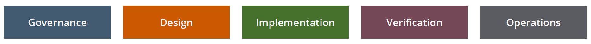
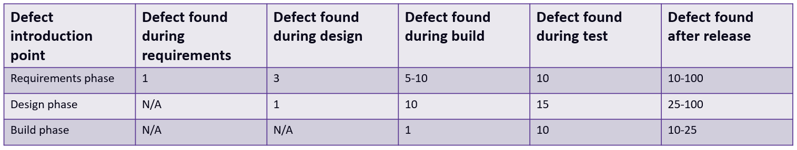
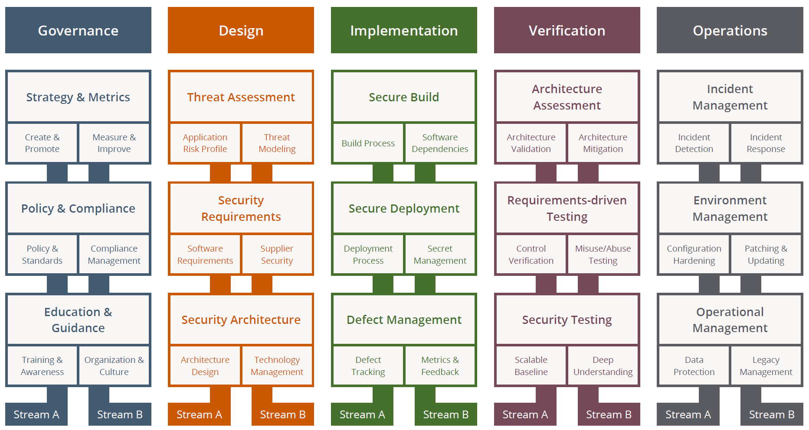

# Introduction
When software is developed, it passes through a software development lifecycle. Such a cycle can have many stages, but typically we see the following stages:

Sofware defects will always occur, regardless the experience of the project team involved. Software defects are costly, especially if they are discovered late in the lifecycle. The following is a table outlining the relative cost to fix a defect, depending on when it was discovered (Microsoft, 2006):

Let's consider the first row of the table, where it is assumed the defect was introduced in the requirement's phase (the requirement could be wrong, or it could simply be forgotten). Let's how this cost increases depending on when the defect is found:
* during design: 3 times more expensive
* during implementation (build): 5-10 times more expensive
* during verification: 10 times more expensive
* after release, during operations: 10-100 times more expensive

Security defects are also defects. And they are also costly. That's why we need to execute security activities during each phase of the lifecycle. The goal is to discover security defects as 'left' as possible in the lifecycle. Some people call this 'shift security left', or use the term 'secdevops' to refer to a lifecycle where security is built in. 

[OWASP SAMM (Software Assurance Maturity Model)](https://owaspsamm.org/model/) provides a metamodel for a security software development lifecycle: 

Take a good look at the above picture. Throughout this software security course, we have focused on the `Secure Build` practice: you have learned about secure coding guidelines, and some of you have played with static code review tooling. However, it is important that you understand the bigger picture and that other steps are also important in the software development lifecycle to come to a finished piece of software. `Threat modeling` (a part of threat assessment) is such a step which is (very) briefly introduced here. 

# Source attribution
Some parts of this page are based on [OWASP SAMM](https://owasp.org/www-project-samm/), which is licensed under [FLOSS](https://owasp.org/about/).