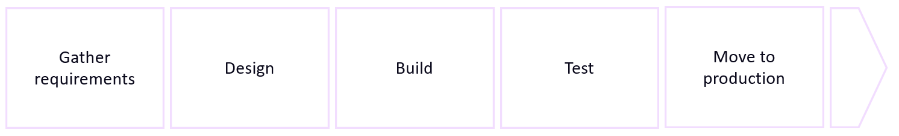
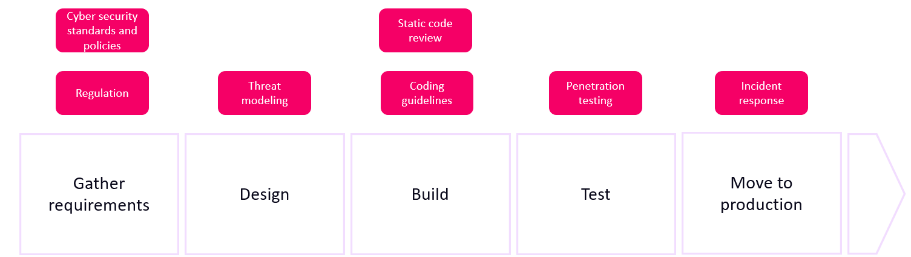

# Introduction
When software is developed, it passes through a software development lifecycle. Such a cycle can have many stages, but typically we see the following stages:

* Gather requirements
* Design
* Build
* Test
* Move to production

Most project teams focus on delivering the software as fast as possible according to the functional requirements of the customer, with as least defects as possible. Defects are costly, especially if they are discovered late in the lifecycle. The following is a table outlining the relative cost to fix a defect, depending on when it was discovered (Microsoft, 2006):

Let's consider the first row of the table, where it is assumed the defect was introduced in the requirement's phase (the requirement could be wrong, or it could simply be forgotten). Let's how this cost increases depending on when the defect is found:
* during design: 3 times more expensive
* during build: 5-10 times more expensive
* during test: 10 times more expensive
* after release: 10-100 times more expensive

Security defects are also defects. That's why, during each of the above phases, security must be kept in mind. Let's therefore upgrade our software development lifecycle to a secure software development lifecycle:

Activities focusing on security have now been added to each phase. Throughout this software security course, we have focused on the `build` phase: you have learned about secure coding guidelines, and some of you have played with static code review tooling. However, it is important that you understand the bigger picture and that other steps must be executed to get to a finished piece of software. The `gather requirements`, `test`, and `move to production` security activities are outside the scope of this course, however `threat modeling` is (very) briefly introduced here. 
