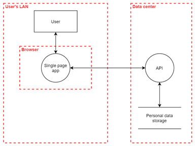
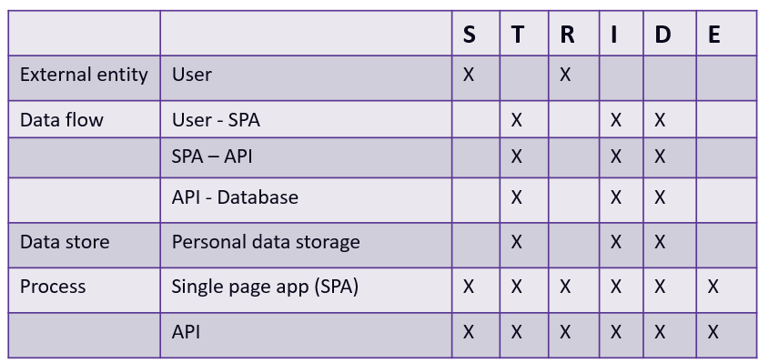

# The basics of threat modeling
Threat modeling takes place during the design phase, and focuses on four key questions:
* what are we building?
* what can go wrong?
* what are we going to do about it?
* did we do a decent job of analysis?

Even though models are an important tool to be used during threat modeling, creating a model is not the end goal. The end goal is to come up with a list of issues that need fixing.

# How to threat model
Many times you will work together with software architectus, who perhaps have already created a model of the software architecture. Or perhaps you have created on yourself. Any model can be used during a threat modeling session, and there's usually no need to come up with a new model. However, in case there is no model yet, it is advised to create a Data Flow Diagrams (DFD). An example of a DFD is this one:

A DFD consists of:
* rectangles: these represent external entities, interacting with the system (e.g. a user)
* arrows: these represent data flows (e.g. the data flow from a user to the single page app)
* two parallel lines: these represent data stores (e.g. a database)
* circles: these represent processes (e.g. the API)
* dotted lines: these represent trust boundaries (e.g. the data center's network)

Note that different people may use different notations, but the above 5 elements are always present in a DFD. Once your DFD is finished, it should already give you a good view on the entry points of the application (i.e. `the attack surface`). You should always keep the attack surface as small as possible. Examples of actions that increase the attack surface are: opening ports, adding certificates, adding (technical) users, writing files, opening firewall ports, etc. 

# STRIDE
Now that you have your model, it's time to investigate it for threats. Gather your team and start brainstorming about potential threats. Write them down, do not come up with actions yet, simply focus on the threats. Some teams may find it hard to come up with threats, or need a way to bring in more structure. The mnemonic `STRIDE` can help you by providing 6 threat categories:
* **S**poofing
* **T**ampering
* **R**epudiation
* **I**nformation disclosure
* **D**enial of service
* **E**levation of privilege

Each of these categories can be applied to some of the DFD components that we saw previously. The mapping is given in the table below:

Let's take tampering as an example. Tampering means that an unauthorized attacker is able to modify the data. In other words, tampering violates our integrity principle. The tampering threat category can be applied to all components except for external entities. That's pretty intuitive: an attacker can tamper with the data flow, the data store, or the process, but it is hard to tamper with a user (unless you would consider social engineering tampering, but let's not go down that road). So, this table tells us that we should not worry about tampering threats for the external entities in our diagram, but we should do so for all the other components. 

Now, you may wonder, if tampering is a category, that means there should be more specific threats inside that category right? That's true, and here are some examples of specific tampering threats (Microsoft, EoP threat modelling card game):
* an attacker can replay data without detection because your code does not provide timestamps or sequence numbers
* an attacker can write to a data store your code relies on
* an attacker can alter information in a data store because it has open permissions
* an attacker can change parameters over a trust boundary (e.g. SQL injection from a web application to the server in the data center)

In the end, you should end up with a categorized list of threats for each component in your DFD. Some more advanced threat modelers may create a traceability matrix, which is basically the same but contains more information about the identified threats. 

# LINDDUN
While STRIDE focuses on attacks violating the cyber security principles, it does not say a lot about the threats that may exist to the privacy of users. For that, another mnemonic was introduced: `LINDDUN`. While this is outside the scope of this course, feel free to check their website (https://www.linddun.org/linddun) should you ever want to do a threat modeling session that focuses on finding privacy threats. 

