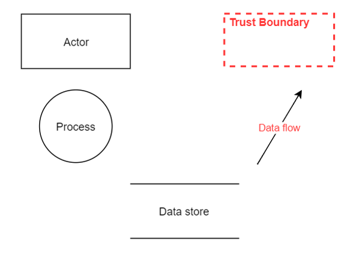
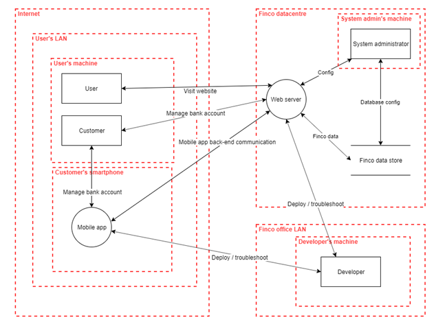
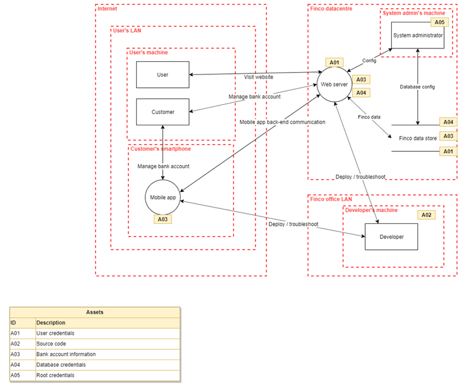
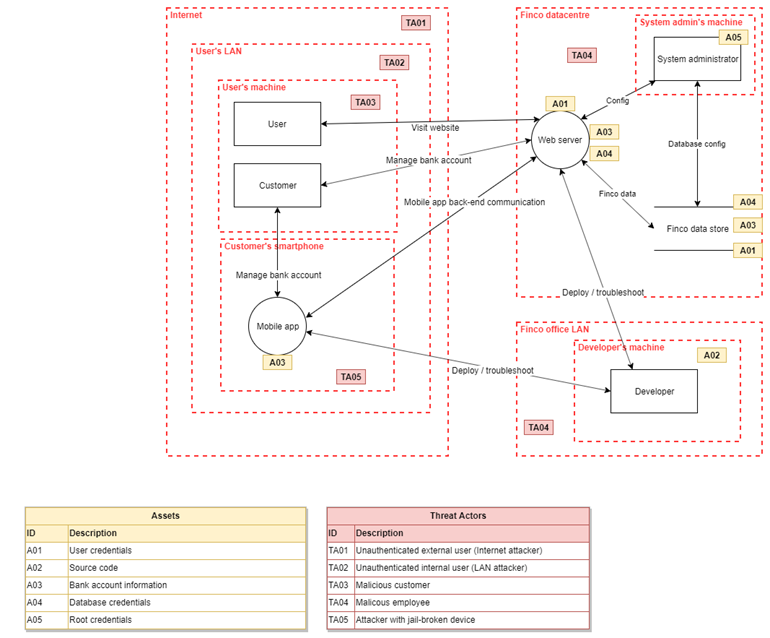
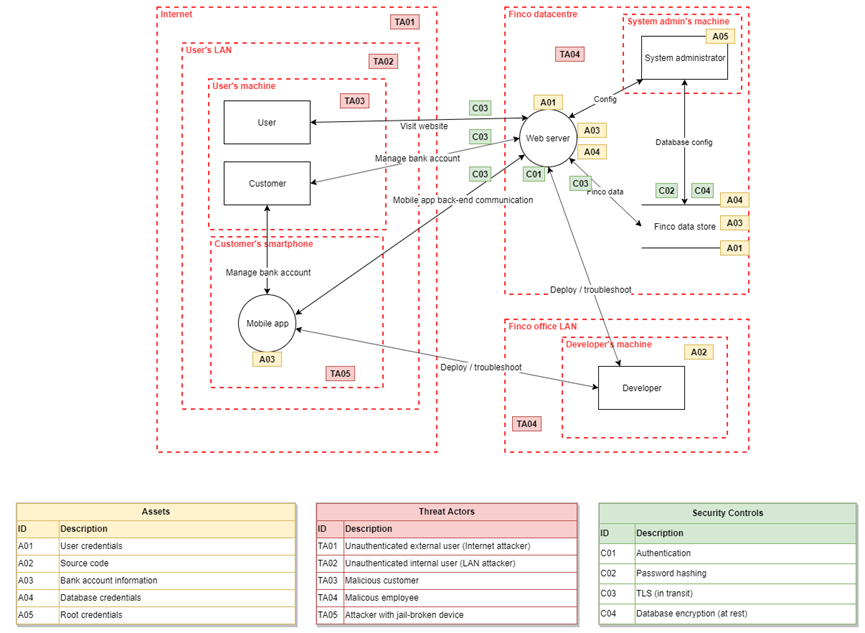

# The basics of threat modeling
Threat modeling takes place during the design phase, and focuses on four key questions:
* what are we building?
* what can go wrong?
* what are we going to do about it?
* did we do a decent job of analysis?

Even though models are an important tool to be used during threat modeling, creating a model is not the end goal. The end goal is to come up with a list of issues that need fixing.

# How to threat model
## Step 0: learn the notation
Many times you will work together with software architectus, who perhaps have already created a model of the software architecture. Or perhaps you have created on yourself. Any model can be used during a threat modeling session, and there's usually no need to come up with a new model. However, in case there is no model yet, it is advised to create a Data Flow Diagrams (DFD). 

A DFD consists of:
* rectangles: these represent **external entities**, interacting with the system (e.g. a user)
* circles: these represent **processes** (e.g. a web server)
* two parallel lines: these represent **data stores** (e.g. a database)
* arrows: these represent **data flows** (e.g. the data flow from a user to the single page app)
* dotted lines: these represent trust boundaries (e.g. the data center's network)

Note that different people may use different notations, but the above 5 elements are always present in a DFD. Once your DFD is finished, it should already give you a good view on the entry points of the application (i.e. `the attack surface`). You should always keep the attack surface as small as possible. Examples of actions that increase the attack surface are: opening ports, adding certificates, adding (technical) users, writing files, opening firewall ports, etc. 

## Step 1: build the model
Create the DFD of the application you are going to build. An example DFD is shown in the figure below:

## Step 2: identify the assets you want to protect
You always have to keep in mind what exactly you wish to protect: does your database contain confidential information? Do you want to protect your source code? Where do you store credentials? 

## Step 3: identify threat actors
Who is it that you want to protect against? In general, the following four kinds of threat actors can be identified:
* Unauthenticated external user (Internet attacker)
* Unauthenticated internal user (LAN attacker)
* Authenticated malicious user (malicious user)
* Authenticated malicious coworker (disgruntled employee)

Other types
* Malicious cloud provider coworker
* Attacker with a jail-broken device

Of course, you are free to add other types of threat actors depending on the context you are working in. 

## Step 4: Start thinking about the threats
This is the core step, since it's here where you will start thinking about the possible threats. 
We usually do not put threats on the diagram to avoid it becoming too cluttered. Instead, they are written down:

| Threat actor   | Vulnerable component  | Threat   | Threat details | Optional: mitigation   |
| -------------  |--  |--  |--  |--   |-- |-- |
| Attacker with a jail-broken device | Mobile app  | Attacker steals credentials stored in mobile app  | An attacker, with a jailbroken device or otherwise able to inspect the contents of the app may get hold of credentials used to call our back-end  |  Each instance of the mobile app should get its own credential which is registered in our back-end upon first use   |
| ... | ...  | ... | ... | ... |

You should not overthink this step and you do not have to be a security expert to be able to come up with relevant threats. However, if you do not know where to start, be sure to read the next [subchapter](.\002threatmodelinginspiration.md).

## Step 5: model the mitigations
Now that you have a list of threats, you should start thinking about how to mitigate those threats. Optionally, these mitigations can be added to the diagram like so:

